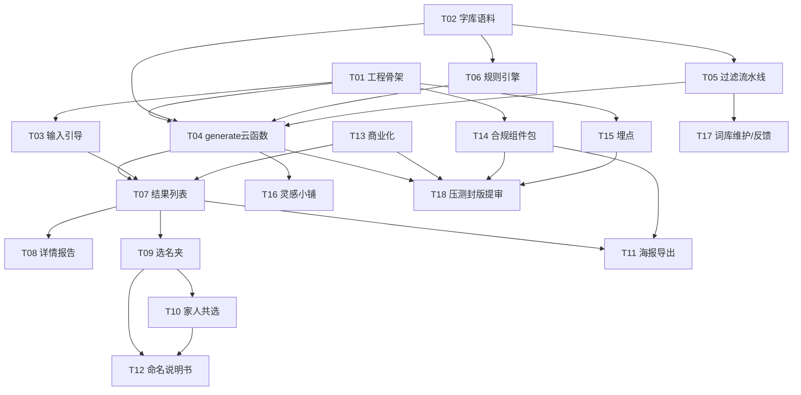

# 开发计划：汉字美学 · AI 取名工具（微信小程序）

**版本**：v1.0 ｜ **日期**：2026-09-06
**上游输入**：PRD `prd-hanzi-naming-v1-2026-09-06.md`、开发交接包 `dev-handoff-package-2026-09-06.md`、高保真原型 `prototype-hanzi-naming.html`（6 屏）
**技术栈（已定）**：原生微信小程序 + 微信云开发 CloudBase（云函数调 LLM，API Key 只存云函数环境变量）
**配套文档**：本目录 `intents/INTENT-T01…T18`（每任务一份独立开工文档）

---

## 1. 总体思路与阶段划分

核心链路只有一条：**输入 → generate 云函数（白名单解空间 → LLM → 过滤流水线 → 落库）→ 结果/详情 → 收藏/共选/分享**。其余（商业化、合规、埋点、灵感小铺）都是这条链路上的横切能力。因此排期以「先打通降级版端到端，再逐步加质量层与商业化层」为原则。

| 阶段 | 时间 | 目标 | 覆盖任务 | 里程碑（可验证状态） |
|------|------|------|----------|----------------------|
| **Phase 0 准备** | W1 前半 | 工程骨架可编译可调用；数据管线启动；埋点底座就位 | T01、T15（基础）、T02（启动） | M0：request.js 调通 echo 云函数；database/ 目录与构建脚本就位 |
| **Phase 1 核心链路** | W1 后半–W2 中 | 端到端出第一批候选（先降级版，再 LLM 版），过滤全链路生效 | T03、T04、T05、T06、T02（收口） | M1：真机输入姓氏→拿到 30 个白名单内候选，谐音/红线/SecCheck 全部拦截生效，block_log 有数据 |
| **Phase 2 决策与分享** | W2 中–W3 中 | 结果展示六维完整、选名夹、共选房间、海报与说明书 | T07、T08、T09、T10、T11、T12 | M2：完整用户旅程（输入→收藏→邀请家人投票→存海报→导说明书）真机走通 |
| **Phase 3 商业化与合规封版** | W3 中–W4 | 虚拟支付、激励视频、合规组件包、词库维护通道、压测提审 | T13、T14、T16(P1)、T17、T18 | M3：支付幂等验证通过；提审 Checklist A–E 全项打勾；封版提审 |

## 2. 模块 → 任务总览表

> 人天为含联调与自测的估算；PRD 口径 P0 约 26–29 人天为纯功能量，此处加上骨架/数据/联调/提审开销后 P0 合计约 **36–40 人天**（单人串行约 5 周，双人并行 4 周内可完成）。

| 编号 | 任务 | 模块 | 优先级 | 人天 | 依赖 | PRD 条目 | 原型屏 |
|------|------|------|--------|------|------|----------|--------|
| T01 | 工程骨架与环境初始化 | 基础设施 | P0 | 1.5 | — | — | 全局 |
| T02 | 字库与语料数据落地 | 数据 | P0 | 4 | — | M2-1（数据部分） | — |
| T03 | 输入与引导 | 输入 | P0（1-4/1-5 为 P1 顺带实现） | 3 | T01 | M1-1~1-5 | 屏01 首页输入 |
| T04 | generate 云函数生成流水线 | 生成引擎 | P0 | 4 | T01, T02, T06 | M2-1/2-2/2-6/2-7/2-8 | 屏01→02 |
| T05 | 过滤流水线与质量兜底 | 生成引擎 | P0 | 3 | T02, T04 | M2-3/2-4/2-5, M8-1 | 屏03 |
| T06 | 规则引擎与音律层 | 生成引擎 | P0 | 2.5 | T02 | M2-1 | — |
| T07 | 结果列表与筛选页 | 结果展示 | P0 | 2.5 | T03, T04, T13 | M3-1/3-2 | 屏02 结果列表 |
| T08 | 名字详情·命名检测报告页 | 结果展示 | P0 | 2.5 | T07 | M3-3 | 屏03 命名检测报告 |
| T09 | 选名夹与收藏 | 结果展示 | P0 | 1.5 | T07 | M3-4 | 屏02/屏06 |
| T10 | 家人共选房间 | 家庭决策 | P0 | 3.5 | T09 | M4-1/4-2 | 屏04 家人共选 |
| T11 | 名字卡片海报 canvas 导出 | 分享 | P0 | 3 | T07, T14 | M5-1/5-2 | 屏05 名字卡片海报 |
| T12 | 命名说明书生成导出 | 家庭决策 | P1 | 2 | T09, T10 | M4-3 | 屏04/05 |
| T13 | 商业化（额度/虚拟支付/激励视频） | 商业化 | P0 | 4.5 | T01, T04 | M7-1/7-2/7-3 | 屏06 选名夹解锁 |
| T14 | 合规工程组件包 | 合规 | P0 | 3.5 | T01 | M8-1~8-4 | 屏01/03/05 |
| T15 | 埋点与数据看板 | 数据 | P0 | 2.5 | T01 | M9-1/9-2 | 全局 |
| T16 | 灵感小铺泛命名 | 引流 | P1 | 2.5 | T04 | M6-1/6-2 | （新增轻页） |
| T17 | 词库维护通道与反馈闭环 | 运营 | P0（通道）/P1（反馈） | 1.5 | T05 | M10-1/10-2 | 屏03 |
| T18 | 性能压测、降级演练、封版与提审 | 交付 | P0 | 3 | T04,T05,T13,T14,T15 | M8-5 + 提审 Checklist | 全局 |

## 3. 关键依赖图

## 4. 人力并行建议

- **开发线（1 人，主线）**：T01 → (T03 ∥ T04) → T07 → T08/T09 → T10 → T11/T12 → T13 → T18。云函数与页面可穿插：每完成一个云函数 action 立即接页面联调。
- **数据/合规线（1 人，并行）**：T02（W1 全周，硬 deadline 是 M1 之前给出白名单+典籍索引）→ 谐音词表补充（粤/英）→ T06 协同（平仄/字频数据口径）→ T17 → 内测 50 例人工评审。
- **合规线（可由数据线兼任，关键节点）**：T14 组件由开发实现，但「隐私指引字段勾选清单」「免责文案定稿」「个体户/算法备案材料」三条线在 W2 前必须定稿（T18 依赖）。
- **LLM 厂商发函与云开发环境有效期证明**：W1 提交，走外部流程，与开发完全并行。

## 5. 风险 Top5（开发视角）

1. **典籍索引质量不达标 → 出处校验率崩**：LLM 引用必须走 quoteRef→本地索引回查（设计上已把风险移到检索侧），T02 索引若晚于 T04 联调，出处维度整体不可用。规避：T02 的「白名单 + 典籍索引」两个文件设为 W1 硬交付物，允许意象标签/字频后补。
2. **微信审核对「命名/取名」话术敏感**：任何评分/吉凶词汇泄漏即驳回。规避：T14 的 grep 校验脚本进 CI，T18 封版前全量扫描。
3. **LLM 超时/结构化输出不稳定**：12s 超时降级规则引擎（3001）+ JSON 解析失败重试 3 次。T18 必须做降级演练。
4. **虚拟支付回调丢失**：reconcile 查单补发必须与支付同批上线，并在支付成功页做兜底触发。
5. **方言数据只有粤语/英语可达标**：P0 只保粤语 jyutping + 英语近似词；川渝词表 P1，其余方言 P2。

## 6. 实现顺序批次（每批次结束有可验证状态）

| 批次 | 任务 | 可并行 | 批次结束的可验证状态 |
|------|------|--------|----------------------|
| B1（W1 上） | T01 + T15(基础) ∥ T02(启动) | 开发线 T01/T15，数据线 T02 | 空壳编译通过、echo 调通、埋点可上报、database 脚本就位 |
| B2（W1 下） | T06 ∥ T04(降级版先行) ∥ T03 | T04 先接 stub 引擎 | 真机：首页输入→降级规则引擎出 30 个白名单内候选（M1 提前达成降级版） |
| B3（W2 上） | T02 收口 + T05 + T04 接 LLM | 数据线收口索引 | 全流水线生效：出处可校验、谐音/红线/SecCheck 拦截、block_log 有数据 |
| B4（W2 下） | T07 → T08 ∥ T09 → T10 | 页面线串行、T14 组件同步挂载 | 核心旅程闭环：输入→结果→详情→收藏→家人投票 |
| B5（W3 上） | T11 → T12 ∥ T13 | T14 持续 | 海报/说明书导出可用；沙箱支付幂等+补发通过 |
| B6（W3 下） | T14 收口 + T17 + T16(P1) | — | 合规组件全覆盖、词库可热更、灵感小铺可切（P1 可按资源裁剪到上线后一周） |
| B7（W4） | T18 | — | 压测报告达标、Checklist A–E 打勾、封版提审（M3） |

**关键路径**：T02(白名单+典籍索引) → T04 → T05 → T07 → T09 → T10；T13 与 T14 可整体后置但不得晚于 B5 结束，否则 W4 提审无窗口。

---

> 任务执行方式：每个任务开工前，工程师直接打开对应 `intents/INTENT-Txx-*.md`，该文档自包含背景/范围/契约/验收，可独立开工；完成后逐项核对验收 checklist。
